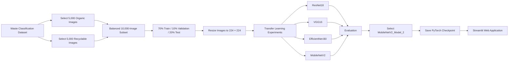

# recyclable_vs_organic_classification
Deep-learning waste classifier for separating organic and recyclable items. It compares 12 transfer-learning experiments across ResNet18, VGG-16, EfficientNet-B0, and MobileNetV2 using accuracy, precision, recall, F1-score, model size, training time, and overfitting analysis, then serves the best model through Streamlit for practical image testing.
---

## Table of Contents

- [Project Overview](#project-overview)
- [Problem Statement](#problem-statement)
- [Project Objectives](#project-objectives)
- [System Workflow](#system-workflow)
- [Dataset](#dataset)
- [Data Preparation](#data-preparation)
- [Model Architectures](#model-architectures)
- [Training Strategy](#training-strategy)
- [Hyperparameter Experiments](#hyperparameter-experiments)
- [Evaluation Metrics](#evaluation-metrics)
- [Results](#results)
- [Selected Model](#selected-model)
- [Streamlit Application](#streamlit-application)
- [Repository Structure](#repository-structure)
- [Installation](#installation)
- [Running the Application](#running-the-application)
- [Reproducing the Experiments](#reproducing-the-experiments)
- [Inference Pipeline](#inference-pipeline)
- [Important Preprocessing Note](#important-preprocessing-note)
- [Limitations](#limitations)
- [Future Improvements](#future-improvements)
- [Troubleshooting](#troubleshooting)
- [Security Note](#security-note)
- [Author](#author)
- [License](#license)

---

## Project Overview

Waste sorting is commonly performed manually, which can be slow, inconsistent, and prone to human error. This project investigates whether transfer learning can be used to classify waste images automatically.

Four convolutional neural network architectures were tested:

- ResNet18
- VGG16
- EfficientNet-B0
- MobileNetV2

Each architecture was trained using three hyperparameter configurations, producing **12 experiments** in total. The models were compared using predictive performance, generalization, training time, parameter count, and saved model size.

The best final model was **MobileNetV2_Model_2**, which achieved **92.50% test accuracy** and had a saved size of approximately **8.73 MB**.

---

## Problem Statement

The objective is to build a binary image-classification system that predicts whether a waste object belongs to one of the following classes:

| Label | Class |
|---:|---|
| `0` | Organic |
| `1` | Recyclable |

A reliable classifier could support smart recycling bins, educational waste-sorting tools, and future automated sorting systems.

This repository is a research and prototype implementation. It is not intended to control a production waste-sorting system without additional real-world testing.

---

## Project Objectives

The project was designed to:

1. Build a balanced binary waste-image dataset.
2. Apply transfer learning with modern CNN architectures.
3. Compare multiple hyperparameter configurations.
4. evaluate models using accuracy, precision, recall, F1-score, and confusion matrices.
5. Analyze overfitting and generalization.
6. Compare model size, parameter count, and training time.
7. Select a model suitable for lightweight deployment.
8. Build a Streamlit interface for image upload and prediction.

---

## System Workflow



---

## Dataset

The project uses the **Waste Classification Data** dataset available on Kaggle:

[Waste Classification Data](https://www.kaggle.com/datasets/techsash/waste-classification-data)

The original dataset contains approximately **22,500 images**. A balanced subset of **10,000 images** was selected for the experiments:

| Class | Number of Images |
|---|---:|
| Organic | 5,000 |
| Recyclable | 5,000 |
| **Total** | **10,000** |

### Dataset Split

Each class was split independently to preserve balance:

| Split | Percentage | Organic | Recyclable | Total |
|---|---:|---:|---:|---:|
| Training | 70% | 3,500 | 3,500 | 7,000 |
| Validation | 10% | 500 | 500 | 1,000 |
| Testing | 20% | 1,000 | 1,000 | 2,000 |

A fixed Python random seed of `42` was used before sampling the subset.

---

## Data Preparation

The training notebook applies the following preprocessing steps:

1. Read the image from disk.
2. Convert the image to RGB.
3. Resize the image to `224 × 224`.
4. Convert the image to a PyTorch tensor.
5. Scale pixel values to the `[0, 1]` range through `ToTensor()`.

```python
transform = transforms.Compose([
    transforms.Resize((224, 224)),
    transforms.ToTensor()
])
```

No data augmentation was applied during the reported experiments.

---

## Model Architectures

### ResNet18

ResNet18 uses residual connections that allow gradients to move through shortcut paths. This helps reduce degradation and vanishing-gradient problems in deeper networks.

For this project:

- ImageNet-pretrained weights were loaded.
- All original model parameters were frozen.
- The original fully connected layer was replaced.
- A dropout layer and a two-output linear layer were added.

### VGG16

VGG16 uses repeated `3 × 3` convolutional layers and a large fully connected classifier.

For this project:

- ImageNet-pretrained convolutional features were loaded.
- The feature extractor was frozen.
- The original classifier was replaced with a custom classifier.
- The custom classifier used two hidden linear layers, ReLU activation, dropout, and a final two-class output layer.

VGG16 produced strong training performance but showed the clearest overfitting and was substantially larger than the other models.

### EfficientNet-B0

EfficientNet-B0 balances network depth, width, and input resolution. It uses MBConv blocks and stochastic depth for efficient feature extraction.

For this project:

- ImageNet-pretrained weights were loaded.
- The feature extractor was frozen.
- The classifier was replaced with dropout and a two-class linear layer.
- Multiple stochastic-depth probabilities were tested.

### MobileNetV2

MobileNetV2 is designed for resource-constrained environments. It uses inverted residual blocks and depthwise-separable convolutions to reduce computation and parameter count.

For this project:

- ImageNet-pretrained weights were loaded.
- The feature extractor was frozen.
- The classifier was replaced with dropout and a two-class linear layer.

MobileNetV2 provided the best combination of accuracy, model size, and deployment practicality.

---

## Training Strategy

All models were trained for **10 epochs** using transfer learning.

### Shared Configuration

| Setting | Value |
|---|---|
| Task | Binary image classification |
| Input size | `224 × 224 × 3` |
| Loss function | Cross-Entropy Loss |
| Epochs | 10 |
| Device | CUDA GPU when available, otherwise CPU |
| Frozen layers | Pretrained feature-extraction layers |
| Trainable layers | Replacement classifier layers |

### Optimizers

| Architecture | Optimizer |
|---|---|
| ResNet18 | SGD with momentum |
| VGG16 | Adam with weight decay |
| EfficientNet-B0 | Adam |
| MobileNetV2 | Adam |

During each epoch, the notebook:

1. Enables training mode.
2. Performs forward propagation.
3. Calculates cross-entropy loss.
4. Clears old gradients.
5. Performs backpropagation.
6. Updates trainable parameters.
7. Calculates training accuracy.
8. Switches to evaluation mode.
9. Evaluates the validation set without gradient updates.
10. Stores training and validation loss and accuracy.

---

## Hyperparameter Experiments

Three configurations were tested for each architecture.

### ResNet18

| Model | Dropout | Learning Rate | Batch Size | Momentum |
|---|---:|---:|---:|---:|
| ResNet18_Model_1 | 0.2 | 0.001 | 32 | 0.90 |
| ResNet18_Model_2 | 0.4 | 0.0005 | 32 | 0.85 |
| ResNet18_Model_3 | 0.5 | 0.0001 | 64 | 0.95 |

### VGG16

| Model | Dropout | Learning Rate | Batch Size | Weight Decay |
|---|---:|---:|---:|---:|
| VGG16_Model_1 | 0.2 | 0.001 | 32 | `1e-4` |
| VGG16_Model_2 | 0.4 | 0.0005 | 32 | `5e-4` |
| VGG16_Model_3 | 0.5 | 0.0001 | 64 | `1e-3` |

### EfficientNet-B0

| Model | Dropout | Learning Rate | Batch Size | Drop-Connect Rate |
|---|---:|---:|---:|---:|
| EfficientNetB0_Model_1 | 0.2 | 0.001 | 32 | 0.1 |
| EfficientNetB0_Model_2 | 0.4 | 0.0005 | 32 | 0.2 |
| EfficientNetB0_Model_3 | 0.5 | 0.0001 | 64 | 0.3 |

### MobileNetV2

| Model | Dropout | Learning Rate | Batch Size |
|---|---:|---:|---:|
| MobileNetV2_Model_1 | 0.2 | 0.001 | 32 |
| MobileNetV2_Model_2 | 0.4 | 0.0005 | 32 |
| MobileNetV2_Model_3 | 0.5 | 0.0001 | 64 |

---

## Evaluation Metrics

The models were evaluated on a held-out test set of 2,000 images.

### Accuracy

Measures the proportion of all predictions that were correct.

\[
Accuracy = \frac{TP + TN}{TP + TN + FP + FN}
\]

### Precision

Measures how many images predicted as a class actually belonged to that class.

\[
Precision = \frac{TP}{TP + FP}
\]

### Recall

Measures how many real examples of a class were correctly detected.

\[
Recall = \frac{TP}{TP + FN}
\]

### F1-Score

The harmonic mean of precision and recall.

\[
F1 = 2 \times \frac{Precision \times Recall}{Precision + Recall}
\]

### Confusion Matrix

The confusion matrix shows correct and incorrect predictions for both Organic and Recyclable classes.

Weighted precision, recall, and F1-score were calculated with scikit-learn.

---

## Results

### Best Model from Each Architecture

| Architecture | Best Configuration | Test Accuracy | Test Precision | Test Recall | Test F1 |
|---|---|---:|---:|---:|---:|
| MobileNetV2 | MobileNetV2_Model_2 | **92.50%** | **92.50%** | **92.50%** | **92.50%** |
| EfficientNet-B0 | EfficientNetB0_Model_1 | 92.25% | 92.25% | 92.25% | 92.25% |
| VGG16 | VGG16_Model_1 | 91.55% | 91.56% | 91.55% | 91.55% |
| ResNet18 | ResNet18_Model_2 | 91.40% | 91.44% | 91.40% | 91.40% |

### Efficiency Comparison

| Architecture | Best Model | Training Time | Saved Size | Parameters |
|---|---|---:|---:|---:|
| ResNet18 | ResNet18_Model_2 | 3.61 min | 42.72 MB | 11,187,158 |
| VGG16 | VGG16_Model_1 | 7.54 min | 464.17 MB | 121,676,610 |
| EfficientNet-B0 | EfficientNetB0_Model_1 | 3.68 min | 15.59 MB | 4,052,175 |
| MobileNetV2 | MobileNetV2_Model_2 | 4.53 min | **8.73 MB** | **2,260,598** |

Training times depend on the hardware and software environment and should be treated as experiment-specific measurements.

### Generalization Analysis

- **ResNet18** had the smallest difference between training and test performance, indicating stable generalization.
- **VGG16** achieved extremely high training accuracy but lower validation and test accuracy, indicating overfitting.
- **EfficientNet-B0** achieved a strong balance between accuracy, size, and training time.
- **MobileNetV2** achieved the best final test performance while also being the smallest model.

### Best-Model Confusion Matrix Summary

For MobileNetV2_Model_2:

- 74 Organic images were classified as Recyclable.
- 76 Recyclable images were classified as Organic.
- The similar error counts indicate balanced behavior across the two classes.

---

## Selected Model

The deployed model is:

```text
MobileNetV2_Model_2
```

### Configuration

| Property | Value |
|---|---|
| Architecture | MobileNetV2 |
| Dropout | 0.4 |
| Learning rate | 0.0005 |
| Batch size | 32 |
| Optimizer | Adam |
| Test accuracy | 92.50% |
| Test F1-score | 92.50% |
| Saved size | 8.73 MB |

### Why MobileNetV2 Was Selected

MobileNetV2 was selected because it:

- Achieved the highest test accuracy.
- Achieved the highest test F1-score.
- Produced balanced errors between both classes.
- Used the fewest parameters.
- Produced the smallest checkpoint.
- Is more suitable for lightweight or edge deployment than VGG16, ResNet18, or EfficientNet-B0.

---

## Streamlit Application

The Streamlit application allows a user to:

1. Upload a `.jpg`, `.jpeg`, or `.png` image.
2. Preview the uploaded image.
3. Run the MobileNetV2 classifier.
4. View the predicted class.
5. View the confidence percentage.
6. Compare confidence values for both classes in a table and bar chart.

The application automatically uses CUDA when available and falls back to the CPU otherwise.

### Prediction Output

The interface returns:

```text
Predicted class: Organic or Recyclable
Confidence: percentage assigned to the selected class
Class percentages: confidence for both output classes
```

The confidence values are produced by applying softmax to the model logits. They should not automatically be interpreted as calibrated probabilities.

---

## Repository Structure

Before publishing, rename the uploaded files to clean repository-friendly names and organize them as follows:

```text
waste-object-classification/
│
├── app.py
├── README.md
├── requirements.txt
├── .gitignore
├── LICENSE
│
├── models/
│   └── MobileNetV2_Model_2.pth
│
├── notebooks/
│   └── DeepLearning.ipynb
│
├── reports/
│   └── Waste_Object_Classification_Technical_Report.docx
│
└── assets/
    ├── app_home.png
    ├── prediction_example.png
    ├── convergence_plot.png
    └── confusion_matrices.png
```

The `assets/` directory is optional but recommended for screenshots and plots displayed in this README.

---

## Installation

### 1. Clone the Repository

```bash
git clone https://github.com/<your-username>/waste-object-classification.git
cd waste-object-classification
```

Replace `<your-username>` with your GitHub username.

### 2. Create a Virtual Environment

#### Windows PowerShell

```powershell
python -m venv .venv
.venv\Scripts\Activate.ps1
```

#### Windows Command Prompt

```cmd
python -m venv .venv
.venv\Scripts\activate
```

#### Linux or macOS

```bash
python3 -m venv .venv
source .venv/bin/activate
```

### 3. Install Dependencies

```bash
python -m pip install --upgrade pip
pip install -r requirements.txt
```

A suitable `requirements.txt` is:

```text
torch
torchvision
streamlit
pillow
pandas
numpy
matplotlib
scikit-learn
torchinfo
jupyter
```

For stronger reproducibility, create a locked dependency file from the environment used to run the final project:

```bash
pip freeze > requirements-lock.txt
```

---

## Running the Application

Make sure the checkpoint exists at:

```text
models/MobileNetV2_Model_2.pth
```

Update the path in `app.py`:

```python
MODEL_PATH = "models/MobileNetV2_Model_2.pth"
```

Start the application:

```bash
streamlit run app.py
```

Streamlit will display a local address in the terminal, usually similar to:

```text
http://localhost:8501
```

Open that address in a browser and upload a waste image.

---

## Reproducing the Experiments

### 1. Download the Dataset

Download and extract the Kaggle dataset.

Expected source folders:

```text
DATASET/
└── TRAIN/
    ├── O/
    └── R/
```

- `O/` contains Organic images.
- `R/` contains Recyclable images.

### 2. Update the Dataset Path

The original notebook contains a local Windows path. Replace it with the location of the dataset on your machine:

```python
base_train_path = r"path/to/DATASET/TRAIN"
```

### 3. Open the Notebook

```bash
jupyter notebook notebooks/DeepLearning.ipynb
```

### 4. Run the Cells in Order

The notebook performs:

- Package imports
- Dataset loading
- Balanced random sampling
- Train/validation/test splitting
- Dataset and DataLoader creation
- Model construction
- Hyperparameter experiment definition
- Model training
- Checkpoint saving
- Metric calculation
- Confusion-matrix visualization
- Convergence analysis
- Learning-curve analysis
- Model-size and training-time comparison

### 5. Expected Outputs

The notebook can generate:

```text
models/*.pth
histories.pkl
models_sets_results.csv
best_per_arch.csv
```

For cleaner organization, save these files into dedicated directories such as `models/`, `results/`, and `history/`.

---

## Inference Pipeline

The deployed application follows this pipeline:

```text
Uploaded image
    ↓
Convert to RGB
    ↓
Resize to 224 × 224
    ↓
Convert to tensor
    ↓
Add batch dimension
    ↓
Move tensor to CPU or GPU
    ↓
MobileNetV2 forward pass
    ↓
Softmax over two logits
    ↓
Select highest-confidence class
    ↓
Display class and percentages
```

The model is placed in evaluation mode with:

```python
model.eval()
```

Gradient tracking is disabled during inference:

```python
with torch.no_grad():
    outputs = model(image_tensor)
```

This prevents parameter updates and reduces unnecessary memory usage.

---

## Important Preprocessing Note

The reported training notebook uses:

```python
transforms.Resize((224, 224))
transforms.ToTensor()
```

The current Streamlit application additionally applies ImageNet normalization:

```python
transforms.Normalize(
    mean=[0.485, 0.456, 0.406],
    std=[0.229, 0.224, 0.225]
)
```

Training and inference preprocessing must match.

Before publishing or deploying the current checkpoint, choose one consistent approach:

### Option A: Match the Existing Checkpoint

Remove the normalization step from `app.py` so inference matches the preprocessing used to train and evaluate the uploaded checkpoint.

### Option B: Use ImageNet Normalization Correctly

Add ImageNet normalization to the notebook, retrain all models, reevaluate them, and export a new checkpoint.

Do not report the original 92.50% test accuracy for a differently preprocessed model unless it has been evaluated again.

---

## Limitations

This project has several important limitations:

1. **Binary classification only**  
   The system predicts only Organic or Recyclable. It does not distinguish plastic, paper, glass, metal, cardboard, food waste, or other subclasses.

2. **No data augmentation**  
   The reported training pipeline did not include rotation, flipping, brightness adjustment, blur, crop variation, or background augmentation.

3. **Benchmark-data dependence**  
   Performance was measured on a subset of the Kaggle dataset. Real photographs may contain different lighting, backgrounds, camera angles, object sizes, and image quality.

4. **No live-camera input**  
   The Streamlit prototype accepts uploaded files but does not process a webcam or continuous video stream.

5. **No confidence calibration**  
   Softmax confidence can be high even when a prediction is incorrect.

6. **No real-time inference benchmark**  
   Model size and training time were recorded, but deployment latency, throughput, and memory consumption were not fully benchmarked.

7. **Frozen feature extractors**  
   Only classifier layers were trained. Partial fine-tuning may improve performance.

8. **Single random subset**  
   The experiments used one balanced sample and one train/validation/test split. Repeated runs or cross-validation would provide stronger evidence.

---


## Troubleshooting

### `FileNotFoundError: MobileNetV2_Model_2.pth`

Confirm that the checkpoint exists and that `MODEL_PATH` is correct:

```python
MODEL_PATH = "models/MobileNetV2_Model_2.pth"
```

### State-Dictionary Loading Error

The model architecture must match the architecture used during training:

```python
model.classifier = nn.Sequential(
    nn.Dropout(p=0.4),
    nn.Linear(in_features, 2)
)
```

A different dropout layer does not change the state-dictionary shape, but a different output size or classifier structure will.

### CUDA Is Not Available

Check the installed PyTorch build:

```python
import torch

print(torch.__version__)
print(torch.version.cuda)
print(torch.cuda.is_available())
```

A CPU-only PyTorch installation will run the application on the CPU even when the computer has a supported GPU.

### Predictions Differ from Notebook Results

Check that all of the following match the training pipeline:

- Class order
- Image size
- RGB conversion
- Tensor conversion
- Normalization
- Model architecture
- Checkpoint file
- PyTorch and torchvision versions

### Streamlit Does Not Start

Run:

```bash
python -m streamlit run app.py
```

This ensures that Streamlit is executed from the active Python environment.

## Author

**Mohammad Sammour**
